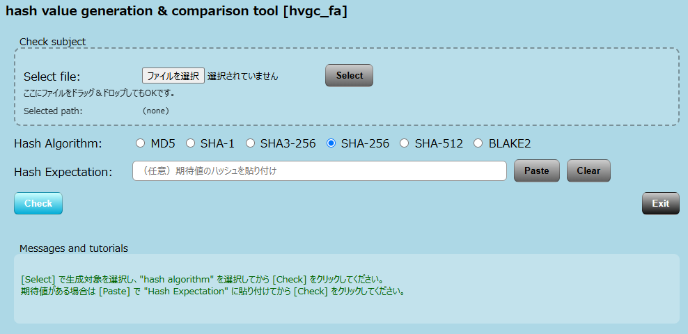

<p align="left">
  
  
</p>

# hash value generation & comparison tool [hvgc_fa]


## Overview
　ファイルの整合性確認（**Checksum検証**）を手作業で行う際の手間とミスを削減するために開発したツールです。  

　複数のハッシュアルゴリズムに対応し、生成結果と期待値の比較をワンステップで実行可能です。  
　業務における検証作業の効率化およびヒューマンエラー防止を目的としています。

　また、**FastAPI** により API 化することで、ローカル利用に加えて  
　将来的な自動化処理やクラウド環境での利用も視野に入れた構成としています。

## Features
- ファイルからハッシュ値を生成
- 期待値との比較（**Match** / **Discrepancy** 表示）
- ｢**Select**｣による選択、または Drag & Dropによるチェック対象の転送（Upload）
- 複数アルゴリズム対応  
　**MD5** / **SHA-1** / **SHA-256** / **SHA-512** / **BLAKE2**
- クリップボードから期待値を貼り付け（Paste）
- シンプルなUIによる直感的操作
- エラーハンドリング（未選択・不正入力）
- メッセージ表示による操作ガイド

## API (FastAPI)
　本ツールは **FastAPI** により API 化されています。

### Endpoints
- `POST /hash`  
ファイルをアップロードしてハッシュ値を生成
- `POST /compare`  
生成したハッシュと期待値を比較

## Usage
1. 「**Select**」で対象ファイルを選択  
   またはドラッグ&ドロップでアップロード  
2. ハッシュアルゴリズムを選択  
3. 期待値を貼り付け（任意）  
4. 「**Check**」をクリック  

## Use Case
- ダウンロードファイルの整合性確認
- 配布物の改ざん検知（内容保証）
- 検証作業の自動化前段階としての利用

## UI Components  
### Display content
>| Item | Description | I/O |
>|:--|:--|:--:|  
>|Check subject |Hash生成対象ファイル|In|  
>|Hash Expectation |Hash期待値|In|  
>|Messages and tutorials |Hash値 及び メッセージ / 操作方法|Out|  
### Buttons  
>| Button | Description |  
>|:--|:--|  
>|Select|Hash生成対象ファイル選択|  
>|Paste|期待値ペースト(クリップボード内容をペースト)|  
>|Copy|生成Hash Keyをコピー|  
>| Hash Algorithm|Hash生成アルゴリズム<br>　MD5 / SHA-1 / SHA3-256 / SHA-256 / SHA-512 / BLAKE2 から選択|  
>|Check|Hash生成及び期待値比較|  
>|Clear|入力情報消去|  
>|Exit|ツール終了|  

## Tech Stack
- Python 3.x
- FastAPI
- Jinja2 (FastAPIインストール時に自動でインストール)
- python-multipart

## Requirements
- Python 3.10 以上
- pip

<!-- ## Build (for developers)  -->
## Common development environment
　　[ **Common settings for the development environment**](https://github.com/AHazeyama/Tkinter_tools/blob/main/CommonSettings.md)  
　　 `Tech Stack`の項目をインストールする事。

## Run (Local)
　  
```pwsh
　uvicorn app:app --host 0.0.0.0 --port 8000 --reload
```
## Access
* Application  
http://localhost:8000
* Swagger UI  
http://localhost:8000/docs

## Run with Docker
　Docker を使用して実行することもできます。  
　  
　　Docker作成  
```pwsh  
　　docker build -t hvgc_fa .  
```  
　Docker実行  
```pwsh  
　　docker run -p 8000:8000 hvgc_fa
```

## Access
* Application  
http://localhost:8000  
* Swagger UI  
http://localhost:8000/docs

## Deployment Perspective
　本ツールは単体のローカルGUI用途に留まらず、**FastAPI** による API 化により、以下のような運用を想定しています。  
* ローカル環境での検証ツール
* 社内向けAPIとしての利用
* Docker コンテナによる実行環境の統一
* クラウド環境への展開

## Documentation
　Doxygen により生成できます。  
　ソースコードの可読性向上と構造理解を目的としています。  
　  
　```
doxygen Doxyfile  
　```  
　生成後、以下のファイルをブラウザで開くことでドキュメントを確認できます。  
　```  
🗁 docs/html/index.html  
　```  

## License
TBD
